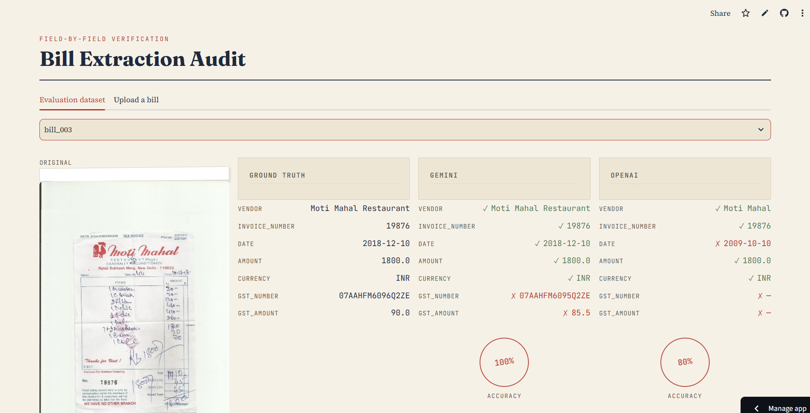
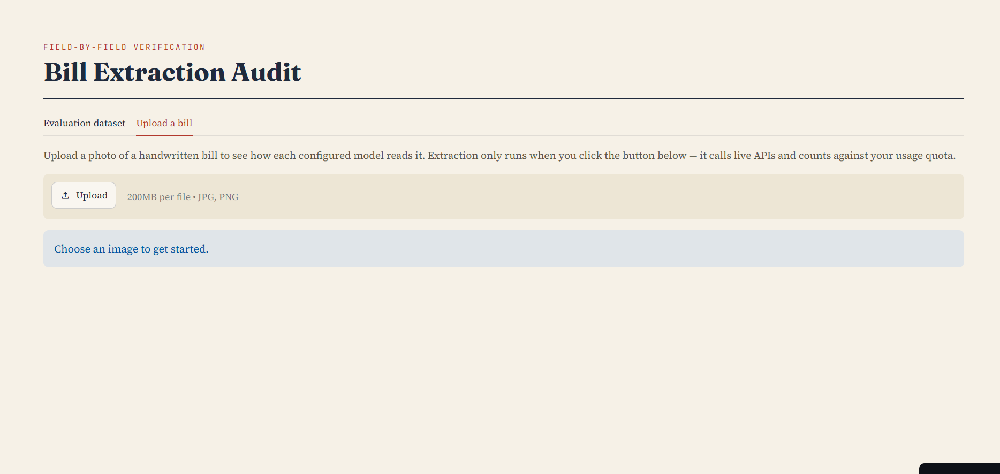
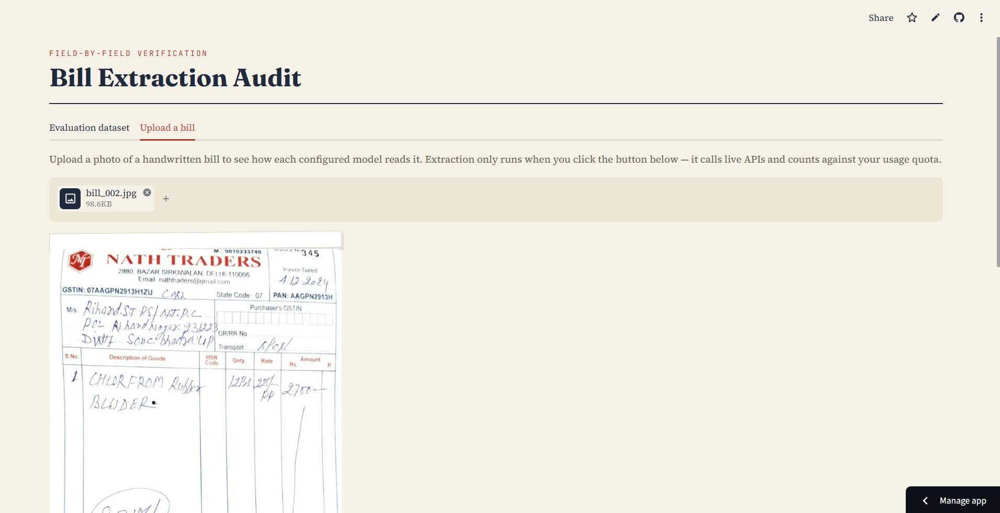
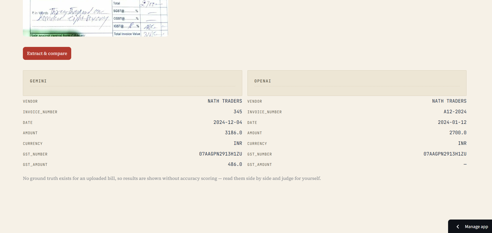

# Handwritten Bill Extraction & Multi-Model Evaluation

## Overview
Extracts structured data (vendor, amount, date, currency, tax details) from photos of
handwritten bills using multiple vision-capable LLMs, scores each model's accuracy
field-by-field against hand-verified ground truth, estimates API cost per model, and
pushes the extracted data into Zoho Books as real expense entries.

## Architecture
```
bill-extraction-eval/
├── data/
│   ├── raw_bills/               # bill images
│   └── ground_truth.json        # hand-verified correct values per bill
├── src/
│   ├── schema.py                 # pydantic schema every model output must match
│   ├── prompt.py                 # shared extraction prompt (same across models)
│   ├── extractors/
│   │   ├── base.py
│   │   ├── gemini_extractor.py
│   │   └── openai_extractor.py   # via OpenRouter, gpt-4o-mini
│   ├── eval/
│   │   ├── scorer.py             # field-level accuracy scoring + diagnostics
│   │   └── cost_tracker.py       # estimated cost per model
│   ├── zoho/
│   │   └── zoho_client.py        # OAuth2 + expense creation
│   └── run_pipeline.py           # runs every bill through every model
├── ui/
│   ├── app.py                    # bonus Streamlit UI: dataset comparison + live upload
│   └── .streamlit/
│       └── config.toml           # UI theme
├── push_to_zoho.py               # pushes extracted data into Zoho Books
├── results/
│   ├── raw_outputs/{model}/      # per-bill JSON output per model
│   └── report.md                 # final accuracy + cost tables
├── .env.example
└── requirements.txt
```

**Pipeline flow:** bill image → same prompt sent to each model → each model returns
JSON matching a shared schema → outputs saved per model per bill → scorer compares
against ground truth field-by-field → cost tracker estimates spend → extracted data
is pushed to Zoho Books as expense entries.

## Setup
```
git clone <your-repo-url>
cd bill-extraction-eval
python -m venv venv
venv\Scripts\activate
pip install -r requirements.txt
cp .env.example .env
```
Then fill in your real API keys and Zoho credentials inside `.env`.

## Usage
```
python -m src.run_pipeline      # extract data from all bills, all models
python -m src.eval.scorer       # score accuracy per model per field
python -m src.eval.cost_tracker # estimate cost per model
python push_to_zoho.py          # push extracted data to Zoho Books
streamlit run ui/app.py         # bonus: dataset comparison + live upload UI
```

## Bonus UI
Live demo: https://bill-extraction-audit.streamlit.app
(If unavailable — free-tier hosting can sleep after inactivity, or API quota may be
exhausted — screenshots below, or run locally: `streamlit run ui/app.py`)

**Evaluation dataset tab:**


**Upload a bill tab — before extraction:**


**Upload a bill tab — after extraction:**



Two tabs:
- **Evaluation dataset** — pick any of the 12 bills, see the original image, ground
  truth, and each model's extraction side by side with ✓/✗ per-field markers and an
  overall accuracy score.
- **Upload a bill** — upload a new bill image and see live extraction from each
  configured model, side by side. Extraction only runs on button click (not on every
  page interaction) to avoid burning API quota unnecessarily.

## Dataset
12 handwritten Indian bills — grocery, restaurant, tailoring, retail, stationery, and
canteen receipts — chosen for variety in handwriting style, format, and legibility.
Includes one Malayalam-script bill alongside English-script bills, to test whether
extraction accuracy holds across scripts, not just handwriting styles. Personal names
of individual customers were cropped/redacted from bill images before use, per the
task's privacy guidance.

## Scoring methodology
- **Exact match** — date, currency, invoice_number: these should either match
  exactly or not at all.
- **Numeric tolerance** — amount: compared as normalized numbers, currency symbols
  and commas stripped, rather than string match.
- **Fuzzy match** (rapidfuzz `partial_ratio`, case-insensitive) — vendor name:
  initially used `token_sort_ratio`, but switched to `partial_ratio` after noticing
  models often returned the correct core business name while dropping a generic
  suffix (e.g. "Moti Mahal" vs ground truth "Moti Mahal Restaurant").
  `token_sort_ratio` penalized these as near-misses even though the vendor was
  correctly identified; `partial_ratio` checks whether the shorter string is
  well-contained in the longer one, scoring these cases as strong matches instead —
  a better reflection of genuine vendor-identification accuracy.

Two diagnostic breakdowns supplement the primary field scores, to explain *why* a
field failed rather than just *that* it failed:
- **Date year/month/day breakdown** — isolates which part of a date extraction goes
  wrong, instead of treating any mismatch as equally uninformative.
- **Amount error magnitude (mean, median, max)** — mean alone is easily skewed by a
  single severe outlier in a small dataset, so median is reported alongside it as the
  more representative "typical error when wrong" figure.

Where a bill had genuine ambiguity (e.g. printed total not matching the line-item sum,
or unclear tax computation), ground truth consistently uses the bill's final stated
payable total, and uncertain tax fields are left `null` rather than guessed.

## Results

### Accuracy per model per field
| Model | vendor | invoice_number | date | amount | currency |
|---|---|---|---|---|---|
| gemini | 0.90 | 0.92 | 0.92 | 0.83 | 1.00 |
| openai | 0.92 | 0.75 | 0.25 | 0.42 | 1.00 |

### Date extraction breakdown (year / month / day)
| Model | year | month | day |
|---|---|---|---|
| gemini | 0.92 | 1.00 | 1.00 |
| openai | 0.75 | 0.42 | 0.50 |

OpenAI's date accuracy is weak across all three components, not isolated to one —
year, month, and day are each meaningfully below Gemini's, suggesting a general
difficulty reading handwritten dates rather than one specific format confusion.

### Amount mismatches: mean vs median vs worst case
| Model | Bills wrong | Avg error | Median error | Max error |
|---|---|---|---|---|
| gemini | 2 | 7.7% | 7.7% | 12.2% |
| openai | 7 | 61.9% | 15.3% | 233.3% |

OpenAI's typical error when wrong (median 15.3%) is about double Gemini's (7.7%),
and its worst case (233.3%) is far more severe — a consistent, not just occasional,
accuracy gap on amount extraction.

### Estimated cost per model
| Model | Cost/bill | Cost/100 bills | Total for dataset |
|---|---|---|---|
| gemini | $0.000105 | $0.0105 | $0.0013 |
| openai | $0.00021 | $0.021 | $0.0025 |

## Recommendation
Gemini outperforms OpenAI (gpt-4o-mini) on every field, with the largest gaps in date
(0.92 vs 0.25) and amount extraction (median error 7.7% vs 15.3%), while also costing
roughly half as much. For handwritten bill extraction — Indian small-business receipts
in particular — Gemini is the clear choice on both accuracy and cost. For digital
(typed/printed) documents, both models would likely perform much closer to parity, since
the difficulty here is specifically reading handwriting rather than general document
understanding — a separate, lighter-weight pipeline could reasonably use either model,
or default to the cheaper option, for typed invoices.

## Known limitations
- Small sample size (12 bills) — findings are directional, not statistically robust.
- Cost estimates use average token assumptions, not per-call logged usage; a
  production version would capture `response.usage` at call time for exact costs.
- A few bills had inherent ambiguity (printed total vs recalculated total, unclear tax
  computation) — resolved by trusting the bill's stated total and leaving uncertain
  tax fields `null` rather than guessing.
- Gemini free-tier rate limits (20 req/day) were hit during testing, requiring the run
  to be split across sessions.
- Amount error percentages are a comparative signal between models on identical
  images, not an absolute measure of handwriting difficulty — with a small sample,
  a single severe misread can still meaningfully shift results, which is why median
  and max are reported alongside the mean rather than the mean alone.

## Zoho Books integration
Uses Zoho's self-client OAuth2 flow: a long-lived refresh token (stored in `.env`) is
exchanged for a short-lived access token on each API call, so no long-lived secret
capable of direct API access needs to be stored. `push_to_zoho.py` reads each bill's
extracted fields and creates a corresponding expense entry in Zoho Books via the
Expenses API — turning the AI-read bill data into a real accounting record, the same
way a person would manually enter a receipt, but automatically.
